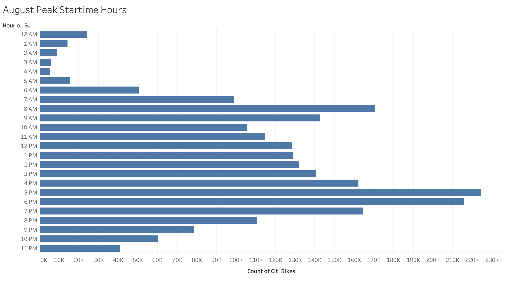

# Bikesharing

[https://public.tableau.com/app/profile/kelly.rice6755/viz/CitiBike_Challenge_16267139846860/CitiBikeAnalysis?publish=yes](https://public.tableau.com/app/profile/kelly.rice6755/viz/CitiBike_Challenge_16267139846860/CitiBikeAnalysis?publish=yes"link to dashboard")

## Overview of Analysis

This analysis uses Tablaeu to create visualizations on Citi Bike data for August 2019 in New York City.  With the data source, I first cleaned the data using Python and Jupyter Notebook to transform the trip duration column in datetime format, so I can use that data in my visualization.  After importing the data source in Tableau, I created 7 visualizations and added each one to my Tableau story on Citi Bike data.  

## Results
There are seven visualizations that show different meanings to the data, which are analyzed below:

### Checkout Times for Users 
This visualization shows the number of bike trips taken as the duration of the bike trip increases.  The peak of total number of bike trips is at about 10 mintues, indicating that most trips are done in relatively short lengths of of time.  The numbers are still higher within the 40 mintue range, in which after the number starts to level out.  Almost no trips are taken that are longer than 1 hour.  This indicates that most bike trips are taken in shorter lengths. 
 

### Checkout by Gender
This visualization shows the same data as the Checkout Times for User, but is enhanced by showing the number of bike trips by gender option.  The different colored lines indicate the different gender options: blue as female, yellow as male, and red as unknown.  The graph indicates that most trips are taken within under an hour, with the peak for both gender options falling between 10-20 minutes.  After the 1 hour mark, the numbeer of trips taken levels out.  This also shows that even though the peak durations are the same for both gender options, the overall number of "Males" taking bike trips is greater.
 

### Trip by Weekday per Hour 
This heatmap shows at which times during the day at each day of the the week have the most stop times of citi bike rides. The darker areas indiciate greater amounts of stop times. The heatmap shows times at 8-9am, and 5-7pm being the darkest areas, inferring that most trips are taken in commuting hours. 
 

### Trip by Weekday per Hour (by Gender)
This heatmap shows the same info at the stop time heat map, except enhanced to show by gender.  The darker areas of map are still within 8-9am and 5-7pm for both gender options, however these areas are darker in the "Male" section.  This heatmap concludes that those indentifying as Males are the greatest users during this time. 
 

### Trips by Gender
This headmap shows the amount of trips taken for each day of the week, split by sser type (subscriber or customer) and gender.  The darker blue areas of the headmap indicate more trips taken.  From this heatmap, we can infer that "male" subscribers on Thursdays take the most bike trips.  In general, the male subscriber section of the heatmap is darker than the rest, indicating this specific group is more likely to use citi bikes.
 

### Top Starting Locations
This map shows the most popular starting locations for Citi Bike trips.  Circles that are larger and darker blue indicate areas of Neew York where most bikes trips start.  Looking at the map, the larger and darker circles are in areas of where popular commuting transportation arrives into the city - such as Penn Station, Port Authority, Grand Central, and World Trade.  This may also lead to the conclusion that many Citi Bikes are used to commute to jobs after ariving into the city from a train or bus. 
 

### Peak Startimes
This horizontal bar graph shows at which times of day the most citi bike trips were taken in the month of August.  The most popular time was 5-6 pm, with 6-7pm coming in as the second most popular time.  The third most popular time is 8-9 am.  These three times being the most for trip rides indicate that many people use Citi Bikes to commute to work in New York.  
 

## Summary

Overall the maps draw similar conclusions that commuting times are the most popular for timse for citi bike rides across both gender options, and that overeall, those who identify as Male are more fequent user.  The visualizations are may idnicate that subscribes take the most bike rides at commuitng time.  its telling that many people in new york use Citi Bike as a way to commute to thier job.  Those that do use Citi Bike as a transportation service are likely to be subscribeers to Citi Bike.  Citi bike is a good invested for cities to ahve because it gives those an affordable communing option other than a local subway.  Additional visualizations can be used to enhance this analysis.  One example of another visualization is using a graph to show which age groups are the most frequent users of citi bikes.  Another example of a visualization is using the station name column to see which station are most popular to citi bike trips to start. 